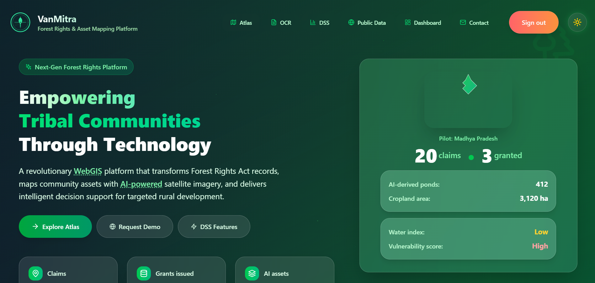
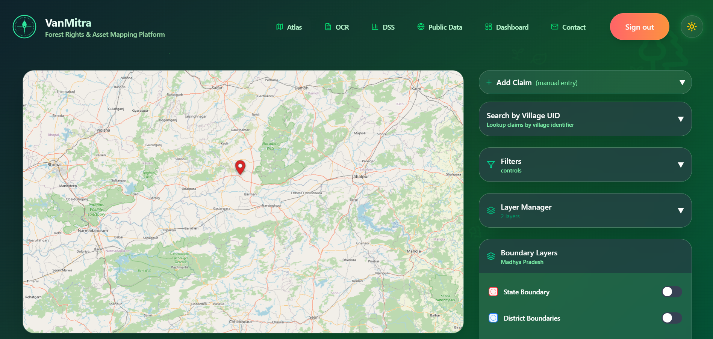
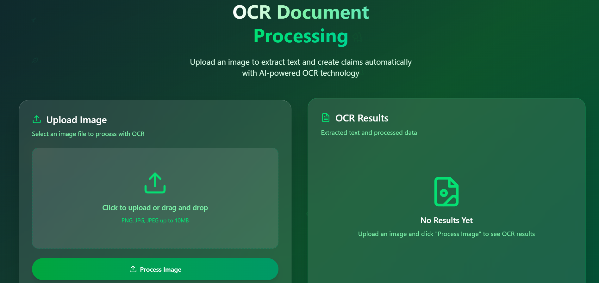
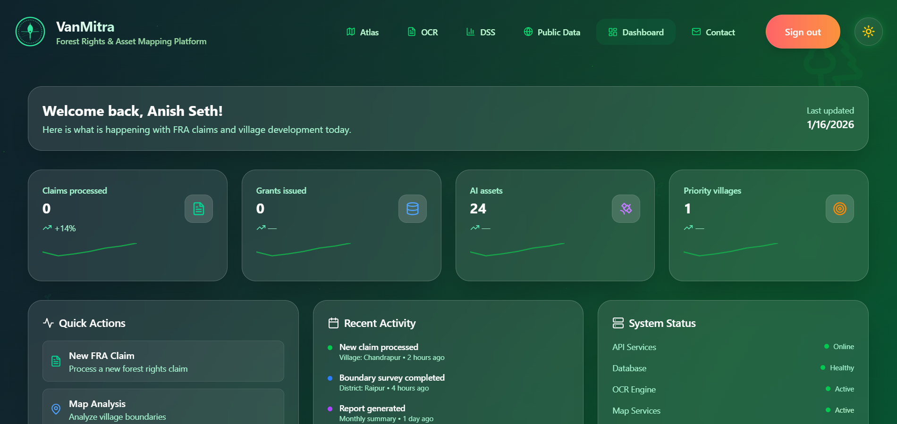

<div align="center">
  
  
  <h1 style="margin:8px 0 0; font-size:40px;">🌳 VanMitra</h1>
  <p style="margin:6px 0 10px; color:#14532d; font-size:18px; font-weight:600;">Forest Rights & Asset Mapping Platform</p>
  <p style="margin:0 0 10px; color:#166534; font-size:15px;">Interactive claims, atlas maps, OCR extraction, and decision support — all in one modern, beautiful app.</p>

  <p>
    <a href="#features"></a>
    <a href="#getting-started"></a>
    <a href="#development"></a>
    <a href="#ui--animations"></a>
  </p>
</div>

<p align="center">
  
</p>

---


## 🌟 What is VanMitra?

> **VanMitra** is a next-generation platform for mapping, tracking, and managing forest rights and assets. It brings together:
>
> - 🗺️ Interactive mapping (MapLibre + GeoJSON)
> - 📄 OCR document processing
> - 📊 Decision-support dashboards
> - ✨ A beautiful, accessible, and modern UI

All in one open-source, developer-friendly app.


## 👀 Quick Visual Snapshot

<div align="center" style="display:flex;gap:24px;flex-wrap:wrap;justify-content:center;">
  
  
  
</div>

---


## ✨ Features

| 🌍 Area         | 🚀 Key Capabilities |
|----------------|--------------------|
| **Atlas & Mapping** | MapLibre-based interactive maps, GeoJSON boundaries, feature drilldown, preview panels |
| **Claims & OCR**    | Uploads, OCR extraction, claim submission endpoints, verification queue |
| **Dashboard & DSS** | KPIs, recommendations, analytics, decision support summaries |
| **UI & UX**         | TailwindCSS design, Framer Motion micro-interactions, accessible components, dark mode |
| **Backend APIs**    | Next.js serverless routes for assets, atlas, OCR, claims |

---


## 🛠️ Tech Stack

<table>
  <tr>
    <td><strong>Frontend</strong></td>
    <td>Next.js (App Router), React 19, Tailwind CSS, Framer Motion, Lucide icons</td>
  </tr>
  <tr>
    <td><strong>Mapping</strong></td>
    <td>maplibre-gl, @maplibre/maplibre-gl-geocoder, GeoJSON data</td>
  </tr>
  <tr>
    <td><strong>Auth / Data</strong></td>
    <td>Firebase (auth + optional storage), serverless API routes</td>
  </tr>
  <tr>
    <td><strong>3D / Visuals</strong></td>
    <td>three, @react-three/fiber, @react-three/drei</td>
  </tr>
</table>

---


## 🚀 Getting Started

Follow these steps locally to run the app for development.

```powershell
# 1) Install dependencies
npm install

# 2) Start the development server
npm run dev

# 3) Optional: run smoke test for API routes
npm run smoke:api
```

Notes:
- Node + npm required. Project was developed and tested against Node 18+ / npm 9+.
- `framer-motion` is already present in dependencies for smooth UI interactions.

---


## 🧩 Development Notes

- App router: source lives under `src/app` (pages & nested routes). Server-like API routes are under `src/app/api`.
- Key UI components are under `src/components` with the `ui` subfolder containing primitives like `button.tsx`, `card.tsx`, `MagneticButton.tsx`, `ThemeToggle.tsx` and `Navbar.tsx`.
- Mapping GeoJSON assets are under the `geojson/` and `data/` folders.


### 🛠️ Useful Scripts

| Script | Purpose |
|---|---|
| `npm run dev` | Run dev server (Next.js)
| `npm run build` | Build for production
| `npm run start` | Start production server
| `npm run smoke:api` | Run a small smoke test for API endpoints (`scripts/smokeTest.mjs`) |

---


## 🎨 UI & Animations

This app uses Framer Motion for consistent micro-interactions across the UI. A few design decisions to note:

- Motion principles: prefer transform-based animations (translate/scale/opacity) for GPU acceleration and no layout shift.
- Reduced motion: components respect the user's OS `prefers-reduced-motion` using Framer Motion's `useReducedMotion()`.
- Magnetic interactions: `MagneticButton` uses motion values to avoid frequent re-renders from mousemove events and to keep animations smooth on low-power devices.
- Accessibility: keyboard focus states are preserved via visible focus rings; motion does not hide focus feedback.

If you'd like the README to visually demonstrate a particular component, I can add a small GIF or animated preview image here — tell me which component to highlight.

---


## 🗂️ Project Structure

```
src/
  app/            # Next.js app routes and API routes
  components/     # Reusable React components (ui primitives & complex pieces)
  lib/            # Utilities (firebase, gis-utils, helpers)
geojson/          # Shape files & GeoJSON boundaries
public/           # Images and static assets (logo used above)
```

---


## 🤝 Contributing

Contributions are welcome. A good first step is:

1. Open an issue describing the change you want to make.
2. Create a branch off `main` named like `feat/<short-description>` or `fix/<short-description>`.
3. Run tests / dev server locally, and open a PR with a concise description and screenshots when relevant.

If you're working on UI/animation improvements, please run the dev server and include short screencasts/GIFs showing the new motion behavior.

---


## 🛟 Troubleshooting

- If you run into hydration or SSR theme flashes, ensure you have a mounted theme guard (components use a `mounted` flag before rendering theme-dependent styles).
- If animations are choppy: try toggling `prefers-reduced-motion` in your OS settings, or ensure your GPU drivers are up to date.

---


## 📄 License & Contact

This project uses an open source-friendly setup — add the license of your choice (e.g., MIT) to the repository root if you want to make it explicit.

For direct questions, reach out to the repo owner.

---


---

<div align="center" style="margin-top:32px;">
  <strong>Made with ❤️ by the VanMitra team</strong><br/>
  <sub>README generated and improved by a dev-assistant — want more visuals or live component demos? Just ask!</sub>
</div>

# VanMitra — Frontend

This repository contains a Next.js prototype frontend for VanMitra (Atlas & DSS).

Local quickstart (PowerShell):

```powershell
cd "c:\Users\ANISH\Documents\PROJECTS\VanMitra"
npm install
npm run dev
```

Available pages
- `/` — Dashboard
- `/map` — Interactive VanMitra map (MapLibre)
- `/dss` — Decision Support
- `/admin` — Admin tools (placeholder)
- `/public` — Public view (sanitized)
- `/login` — Simple prototype login

APIs (mock)
- `GET /api/claims` — sample GeoJSON claims
- `GET /api/recommendations` — sample DSS recommendations

What I implemented
- Animated, forest-themed UI using Tailwind + Framer Motion
- Map with MapLibre consuming local mock GeoJSON and interactive popups
- Layer controls and legend UI
- Lightweight auth context + login page (prototype)
- Mock DSS recommendations API endpoint

Next steps you can ask me to implement
- Wire real backend (FastAPI) and PostGIS integration
- Add Keycloak OIDC flows and role-based UI
- Build ML serving endpoints for asset mapping
- Add offline map tile support and mobile PWA mode
 
Marker sizing and real-world diameter
- The app now enforces a maximum real-world diameter for point/circle layers and DOM markers so very small polygons still show up but they won't visually explode when zoomed out.
- Default maximum diameter: 50 km (50,000 meters).
- Per-layer override: set `layer.style.maxDiameterMeters` (number, meters) when adding a `GISLayer` to the `WebGIS` component.
- Per-marker override: set `marker.maxDiameterMeters` on individual markers passed to `WebGIS`.
- The conversion uses a WebMercator approximation (meters per pixel computed from map center latitude and zoom). This is approximate but fast for interactive updates.
